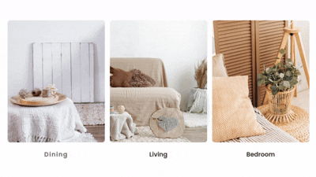
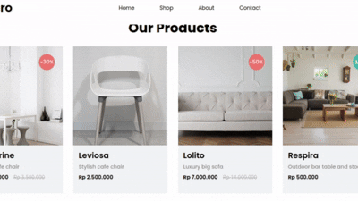
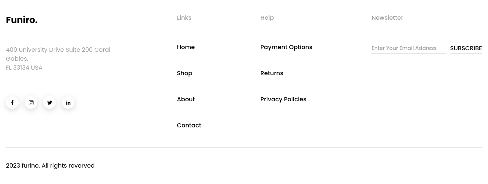
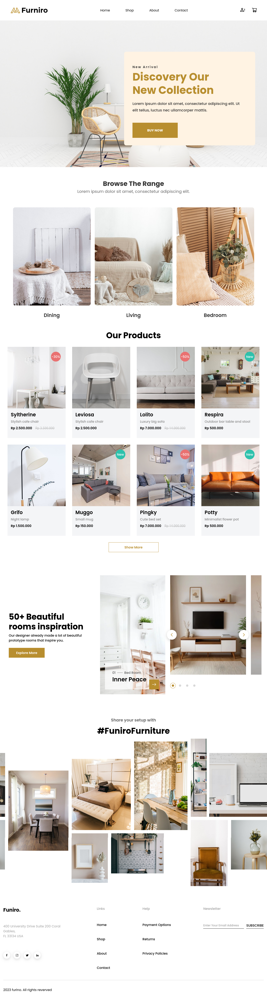

<p align="center">
  
  
  
  
  
  
  
  
  
  
</p>

This was my first delivery for my internship program: the Furniro home page, an e-commerce used for portfolios and templates, with unique features that put into practice the first sprints on React and TypeScript.

# Summary

* [Setup](#setup)
* [Components](#components)
* [Structure](#structure)
* [See the page here!](#see-the-page-here)

---

## Setup

Clone the repository and install the dependencies:

```bash
git clone <repository-url>
cd furniro-web
npm install
```

### Running locally

The project uses a JSON Server as a mock API. Therefore, start the data server first and keep it running.

In one terminal:

```bash
npm run server
```

The mock API will be available at:

```txt
http://localhost:3001
```

In another terminal, start the React application:

```bash
npm run dev
```

The application will be available at:

```txt
http://localhost:5173
```

---

## Components

* [Header](#header)
* [Hero](#hero)
* [Categories](#categories)
* [Product Grid](#product-grid)
* [Carousel](#carousel)
* [Mosaic](#mosaic)
* [Footer](#footer)

---

### Header


It is composed of five components that work together, using Tailwind CSS for styling and clsx for conditional class concatenation.

#### Components

* Header: parent, organizes all elements and manages responsiveness.
* Logo: brand image and text "Furniro".
* NavMenu: navigation links (Home, Shop, About, Contact).
* RightMenu: alert and cart icons.
* MobileMenu: hamburger menu with toggle and dropdown.

This was the first one I made, quite easy. I chose to separate each responsibility into components.

### Hero


I had no difficulty making the hero. The component uses a HeroButton to be reusable with an onClick for future interactivity.

### Categories



It was super simple to make, with featured images and hover effects.

#### Components

* Categories: parent, with title, description, and container for the cards.
* CategoriesCard: individual card with image and label.

### Product Grid



I spent quite a while trying to decide a good way to do the animation, until I arrived at this result. The Tailwind group hover fade technique is a very common pattern to create action overlays on product cards.

It consumes data from a local API, displays products with information like image, name, description, prices, discounts, and "New" or "Sale" badges, and allows loading more products gradually with a "Show More" button.

The system is composed of three main components that work together to create a smooth product browsing experience.

#### Components

* ProductGrid: parent, manages state and makes the API request.
* ProductGridCard: individual card with image, information, badges, and hover actions.
* ProductGridButton: reusable button to load more products.

#### State and Logic

* products: data from the API.
* visibleCount: controls how many products are displayed.
* Increments by 4 products at a time, starting with 8.
* Button is disabled when all products are visible.
* Toast appears as soon as the user clicks on add to cart.

### Carousel


I had no difficulty thinking about the logic. The implementation was a bit confusing at first, but after I understood everything, it worked out.

**Main components:**

* Carousel: displays thumbnails of the next environments, with navigation buttons and indicators.
* CarouselCard: displays the current environment with background image, title, type, and an action button.
* RoomCarousel: parent component that manages the selected index and organizes the previous two side by side.

**Main props:**

* rooms: array of objects `{ image, type, title }`
* currentRoom: active index
* onChangeRoom: function to update the index

### Mosaic


I only managed to understand it when I saw online how they were made, and I adapted it for my project. I had several doubts at first. By far, it was the part I had the most difficulty with and tinkered with the most. However, I believe I reached a good result.

**Main components:**

* Mosaic: parent component that renders the title, hashtag, and the animated container.
* MosaicContent: child component that contains the images positioned in a fixed mosaic layout.

**Animation:**

Inside MosaicContent, nine images are positioned **absolutely** with specific top and left coordinates, forming an asymmetrical mosaic. Each image is wrapped in a div with `overflow-hidden` and a `hover:scale-110` effect with a smooth transition, providing a zoom effect when hovering.

In addition, there is a loop animation where the element moves horizontally to the left by **50%** of its total width (which is `728` units, meaning it moves `364`).

### Footer



It was quite smooth to write this code. I was already so familiar with it that I wrote it very quickly. I was happy about that.

**Features:**

* Email validation via regex — only valid formats are accepted.
* Feedback with react-hot-toast (success or error) when clicking "SUBSCRIBE".
* Social icons with links to Compass UOL profiles, opened in a new tab.

---

## Structure

```text
src/
├── App.tsx            # Root component
├── index.css          # Global styles (includes Tailwind)
├── main.tsx           # Entry point (renders App)
├── components/        # Reusable components organized by domain
│   ├── Carousel/      # Environment carousel (RoomCarousel, Carousel, CarouselCard)
│   ├── Categories/    # Categories section (Categories, CategoriesCard)
│   ├── Container/     # Generic container
│   ├── Footer/        # Footer component
│   ├── Header/        # Header, Logo, NavMenu, RightMenu, MobileMenu
│   ├── Hero/          # Hero and HeroButton
│   ├── Mosaic/        # Mosaic and MosaicContent
│   └── ProductGrid/   # ProductGrid, ProductGridCard, ProductGridButton
└── pages/
    └── Home.tsx       # Home page that groups the sections
```

I chose to create a structure that is not too complex, but one that still makes it possible to refactor without losing control through over-engineering.

## See the page here!


